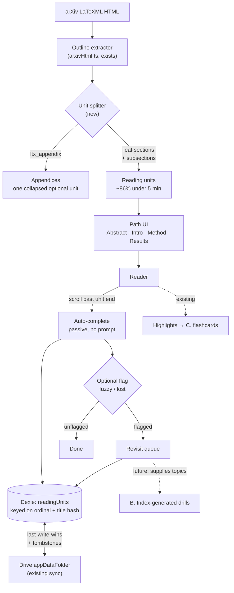

# Guided Reading — Design Decision

*Status: proposed, not built. Written 2026-08-16.*

## Problem

Reading a 40-page paper in this app is one undifferentiated scroll. There is a resume
position and a percentage, but no structure: nothing tells you where you are in the
argument, nothing is ever *finished*, and nothing you learn is ever revisited.

The ask was to borrow from Duolingo. The constraints are fixed and non-negotiable:

- **No AI / LLM.** Original product requirement.
- **No backend.** Static GitHub Pages; per-user state in IndexedDB, synced through
  Google Drive `appDataFolder`.
- **Single maintainer, side project.** Operational burden must be ~zero.

## What actually transfers from Duolingo

Duolingo's magic is not streaks. It is that **someone else already authored ten thousand
bite-sized exercises**. With no AI, the binding question is where interactive content
comes from. There are only four sources, and they are the real design space:

| Source | Can produce | Cost |
| --- | --- | --- |
| The user | Cards from their own highlights | They author it — empty-deck problem |
| The search index | Terminology drills from BM25 term↔doc weights | Free, infinite, already in the browser |
| The paper's structure | Section units, progress, revisit routing | Free; outline extractor already exists |
| Reading behaviour | Dwell time, backtracking, abandonment | Free |
| ~~Other people~~ | ~~Leaderboards, shared decks~~ | **Killed — requires a backend** |

### The engagement mechanics are deliberately excluded

Research on Duolingo's own mechanics argues against copying them here. A *Journal of
Consumer Research* study found users come to value extending a streak over doing the
underlying activity, and learners motivated primarily by gamification show **higher**
abandonment than those motivated by interest in the subject. Users speed-run easy
lessons to protect a streak — firing the reward without the learning.

The user of this app is the intrinsically-motivated case. Streaks and XP are the single
intervention most likely to make them a *worse* reader, by optimising for papers opened
over papers understood.

**Decision: borrow the learning machinery (bite-sized units, active recall, immediate
feedback, spaced revisiting). Refuse the engagement machinery (streaks, XP, leagues,
loss aversion).** Confirmed with the user at intake.

## Options considered

Four directions, varying on *where content comes from* — the structural axis that matters
under a no-AI constraint.

**A. Guided section read** *(chosen)* — content from the document's own structure. Split
each paper into finishable units, show a path, route what you found hard back to you.
Reuses the LaTeXML outline extraction already in `src/reader/arxivHtml.ts`.

**B. Index-generated drills** — content from the search index. Blank the highest-BM25
term in an abstract, draw distractors from terms of similar corpus frequency in the same
category. Novel (nobody else ships a term-document index to the client) and solves the
empty-deck problem, but question quality is unproven.

**C. Highlights → flashcards** — content from the user. Cloze cards from highlights,
scheduled with [ts-fsrs](https://github.com/open-spaced-repetition/ts-fsrs). Highest
learning ceiling, but substantially rebuilds Readwise's Daily Review, and the user must
author every card.

**D. Rhythm / progress signals** — deliberately minimal, per the section above.

A was chosen because it improves *reading itself* rather than adding a side activity, and
because it supplies the signal the other two consume.

## Architecture

## Evidence gathered

Two claims were load-bearing enough to measure rather than assume.

**HTML coverage: 40/40 sampled papers have LaTeXML HTML**, evenly sampled across
2021–2026 from the deployed index. My assumption that pre-2024 papers would fall back to
PDF was wrong. *Caveat:* the corpus is built from an OAI-PMH harvest filtered on
**modification** date, so it is biased toward papers revised recently — which are exactly
the ones arXiv has rendered. A paper reached by direct link from outside the corpus is
less likely to have HTML. PDF degradation is still required, just not on the hot path.

**Unit size — the measurement that set the design.** Three passes:

1. Top-level `ltx_section` only → median 4.8 min, p90 11.7 min, **max 102 min**. Looked fatal.
2. The outliers were all the *last* section, which turned out to be my regex swallowing
   the appendices — arXiv classes them separately as `ltx_appendix` with `Ax1`/`A1` ids.
3. Splitting at every `<section>` and separating appendices: **median 0.7 min, p90 5.1 min,
   max 7.6 min, 86% under five minutes.**

So the granularity problem is real but solved by construction: **split at leaf level, and
collapse appendices into one optional unit.** Appendix sections held the worst outlier at
34 minutes and are trivially detectable.

*(n=8 papers, 51 body sections, 25 appendix sections, at 200 wpm — optimistic for
technical prose. Worth re-running on a larger sample before building.)*

## Premortem

**"It shipped, and six months later it's off."**

*Story 1 — the prompt became noise.* A rating prompt after every unit is an extra action
that returns nothing to the reader right then. Everything gets marked "got it" to dismiss
it, the revisit queue stays empty, and the feature is pure overhead on top of reading.
Visible in advance: Duolingo never asks "did you get it?" — its rating *is* the answer to
a question you already wanted to answer.

*Story 2 — the path lied.* Appendix subsections counted as units, so a paper you had
effectively finished read "6 of 41". Visible in advance — and now measured.

*Story 3 — the state evaporated.* arXiv re-rendered a paper, every section id changed,
completion reset to zero. Visible in advance: this codebase already learned that lesson
and anchors highlights on quoted text precisely because ids are unstable.

## Risk register

| Risk | Severity | Mitigation |
| --- | --- | --- |
| Self-rating is weak and gameable | **Real limitation, capped not fixed** | Treat rating as *routing*, never as assessment. Default to passive completion; rating is optional and never blocks progress |
| Prompt fatigue → reflexive "got it" | Fixable | No modal, no reward attached, inline and dismissible. If ignored it costs nothing |
| Uneven unit size | Fixable — measured | Leaf-level split + appendix collapse → 86% under 5 min |
| arXiv re-render orphans state | Fixable | Key units on `(ordinal, normalised-title-hash)`, not raw element id — same strategy as highlights |
| PDF-only papers have no sections | Fixable | Degrade to page ranges. Measured as rare in-corpus |
| Scope creep into "courses" | Fixable | Explicit non-goal below |
| **Duolingo's skeleton without its nervous system** | **Honest limitation of this direction** | Structure and routing without *testing*. Only option B supplies real recall. State it rather than pretend otherwise |

The last row is the finding that matters most. Readers systematically overrate
comprehension of text they have just read, so "got it" is a soft signal. Option A gives
genuine value — orientation, finishability, and a record of what you found hard — but the
*interactive* half of the original ask is only fully answered when B lands on top of it.

## Recommendation

**Build A, in the shape the evidence dictates**, with one gate.

Do not build the rating layer first. Ship the path and passive auto-completion only —
units, progress, "you are here", resume-to-unit — and use it for a week on five real
papers. **If you never once wish you could flag a section, the rating layer is
unnecessary and its risks were the whole risk.** That isolates the one genuinely
uncertain part for a week of no code.

This is worth building even though it is not, alone, the full Duolingo loop. It makes
papers finishable, which is the complaint underneath the question.

## Rollout

1. **Unit splitter** — extend `arxivHtml.ts`: leaf-level sections, `ltx_appendix`
   collapsed into one optional unit, estimated minutes per unit.
2. **Path UI** — a rail beside the reader; current unit highlighted; resume jumps to unit.
3. **Passive completion** — a unit is done when its end scrolls past the reading line.
   New Dexie table `readingUnits`, added to the sync table list in `src/sync/index.ts`
   (last-write-wins + tombstones already generalise).
4. **Gate: one week of real use.** Then decide on the rating layer.
5. **Only then**: `fuzzy`/`lost` flags and a revisit queue.
6. **Later, separately**: option B, which turns the revisit queue into actual recall.

## Non-goals

Courses, curricula, or prerequisite trees. Streaks, XP, levels, leaderboards. Anything
requiring a backend. Anything requiring a model.

## Open questions

- Unit-size measurement is n=8. Re-run at n≥100 before building the splitter.
- Reading speed for technical prose assumed at 200 wpm; probably optimistic.
- PDF degradation shape is unspecified — page ranges are a guess, not a decision.
- Whether the revisit queue should be per-paper or global across the library.
