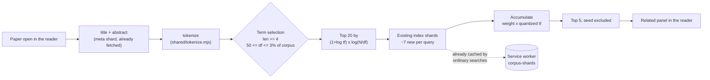

# Corpus reach and related papers — Design Decision

*Status: proposed. Written 2026-08-18. Follows `docs/guided-reading.md`.*

## Problem

The reader searches 441,740 papers, reads them well, and remembers where you were.
Two things it does not do:

1. **It cannot find the papers people actually look up.** Seven of ten landmark AI
   papers are absent from the index.
2. **It cannot get you from one paper to the next.** Discovery was deferred at the
   original planning stage as impractical without a backend.

Constraints are unchanged and non-negotiable: **no AI/LLM**, **no backend** (static
GitHub Pages, per-user state in IndexedDB synced through Drive `appDataFolder`), single
maintainer.

## The corpus gap, measured

| In the index | Missing |
| --- | --- |
| Attention Is All You Need, LLaMA, Chain-of-Thought | BERT, GPT-3, ResNet, GANs, Adam, ViT, DQN |

The cause was flagged when the window was chosen but its consequence was not: OAI-PMH's
`from` filters on **modification** date, so a paper is in the corpus only if it was
revised after `historyStart` (2021-08-01). Attention was revised in 2023 and is present;
BERT has not been touched since 2019 and is not. The corpus nominally spans 1994–2026,
but only for papers that happen to have been revised recently.

This is not a missing feature. It is the product failing the first thing a new user
tries.

### What a 2017 cutoff costs

Counts from arXiv's API for `submittedDate:[2017-01 TO 2021-08]`, deduped by the ×0.69
cross-listing factor measured earlier, minus the share already present:

| | |
| --- | --- |
| Raw records across the six categories | 224,354 |
| After cross-list dedupe | 154,804 |
| Already indexed (sampled 160, 27 present → 17%) | −26,317 |
| **New papers** | **~128,500** |
| **Projected corpus** | **~570,000 papers** |
| **Projected size** | **334 MB of the 1024 MB Pages limit** |

Size is not the constraint. Measured against the live deployment by sampling every shard
type, the corpus costs **614 bytes per paper** — 258 MB today, and the 1 GB ceiling sits
around 1.75 million papers. The design doc's earlier estimate of ~977 B/paper was 60%
too pessimistic.

## Related papers, measured

Discovery does not need a backend, because the term↔document index is *already in the
browser*. "More like this" is the paper's own distinctive terms run back through the
existing search engine.

**Quality.** Across 25 seeds spread evenly through the corpus, **82% of returned papers
(103/125) share at least one arXiv category with the seed**. Category overlap is a proxy,
not proof, but the qualitative samples are strong:

| Seed | Top related |
| --- | --- |
| *Improving the matrix multiplication exponent* | 5 matrix-multiplication papers |
| *Multi-Agent Coordination via Sheaf-ADMM* | Sheaf-Informed Pathfinding · Nonlinear Sheaf Diffusion · Adaptive Consensus ADMM |
| *FreeDiff: Frequency Truncation for Image Editing* | PFB-Diff · Freditor · FRAG · FADE |
| *Multi-Domain EEG Representation Learning* | four cognitive-load papers |

**Cost.** 25 cold queries fetched 180 index shards totalling 95.7 MB — **~7 new shards
and ~3.8 MB per query on a cold cache**, falling steeply as shards warm, and the same
shards ordinary searches already pull. 49s for 25 sequential cold queries; parallelised
in a browser this is well under a second once warm.

Note the trap in that number: sampling *all* shards gives a 71 KB average, but the shards
real queries actually hit average **544 KB**, because common terms live in big shards.
The average shard is not the average *fetched* shard.

## Options considered

**A. Related papers from the local index** *(chosen)* — verified above. No new dependency,
works offline, reuses deployed infrastructure.

**B. Citation graph via OpenAlex** *(not now)* — `api.openalex.org` does send
`Access-Control-Allow-Origin: *`, confirmed, so a no-backend app could read references
and cited-by counts. **Coverage is unverified**: every follow-up query from this
environment returned HTTP 429 on a shared IP. It is also the only option that breaks the
offline property and adds a third-party runtime dependency. Parked until coverage for
week-old arXiv preprints can actually be measured.

**C. Personal feed from saved searches** — "new since you last looked". Local and cheap;
the non-gamified answer to "why open this daily". Parked, not rejected.

**D. Index-generated drills** — still the testing mechanism the reading path lacks.
Parked pending the rating layer's real-world fate.

**E. Widen the corpus** *(chosen)* — config change, no code.

## Risk register

| Risk | Severity | Mitigation |
| --- | --- | --- |
| Reseeding the corpus takes several CI runs | **The real cost of E** | Changing `config/corpus.json` invalidates the cache and forces a full re-harvest; the previous seeding OOMed and needed multiple runs. The harvester now streams and checkpoints per category, and `cache/save` runs `if: always()`, so each run resumes |
| The live site breaks during reseeding | Low | A timed-out harvest fails the job before the index build, so Pages keeps the last good deploy. Verified by reading the workflow, not by running it |
| Related-papers costs ~3.8 MB on a cold cache | Fixable | Cap term count; bias selection toward already-cached shards, since the ranking is approximate anyway. Precomputing at build time is the fallback, at real build cost |
| Related quality unproven beyond a proxy | Fixable | 82% category overlap and 4 strong qualitative samples. A human pass over ~30 seeds before shipping is cheap |
| Related panel gets buried and unused | Fixable | It belongs under the paper body where reading ends, not behind a tab |
| Rarest-terms-first selects typos | **Already hit** | My first prototype returned matches on `fre`, `ncy`, `usion`. Minimum length and minimum document frequency fix it — these are Lucene MoreLikeThis's defaults for exactly this reason |

I looked for a fatal flaw in either and did not find one. E is a config change with a
tedious but well-understood rebuild; A is verified working against live data.

## Recommendation

**Do E first, then A.**

E because it is the cheapest meaningful improvement in the project — one line of config —
and because a 570,000-paper AI search engine that cannot find ResNet is broken in a way
no new feature compensates for. Start the reseed early; it runs unattended across
however many CI runs it needs, and the live site is unaffected until it completes.

A second, because it is verified, self-contained, and closes the discovery gap the
original plan wrote off.

Not B, until someone can measure OpenAlex's coverage of recent arXiv preprints from an
un-throttled address. The CORS header is necessary but nowhere near sufficient.

## Rollout

1. `config/corpus.json`: `historyStart` → `2017-01-01`. Push and let CI reseed across as
   many runs as it takes; confirm with the landmark-paper check that BERT, GPT-3, ResNet,
   GANs, Adam, ViT and DQN resolve.
2. `src/search/related.ts` — term selection and scoring, sharing `shared/tokenize.mjs`
   with the indexer so the two can never drift.
3. A "Related papers" section under the paper body, lazy — nothing fetched until it
   scrolls into view.
4. Unit tests for term selection (length and df floors, the typo case specifically) and
   an end-to-end check that a real paper returns on-topic neighbours.

## Open questions

- OpenAlex coverage of recent arXiv preprints — unmeasured, and the blocker for B.
- Whether 2017 is far enough: AlexNet (2012), GANs (2014) and Adam (2014) still fall
  outside it. Going to 2012 was measured as affordable on size; the cost is harvest time.
- Related-papers quality has no human-judged evaluation yet, only a category proxy.
